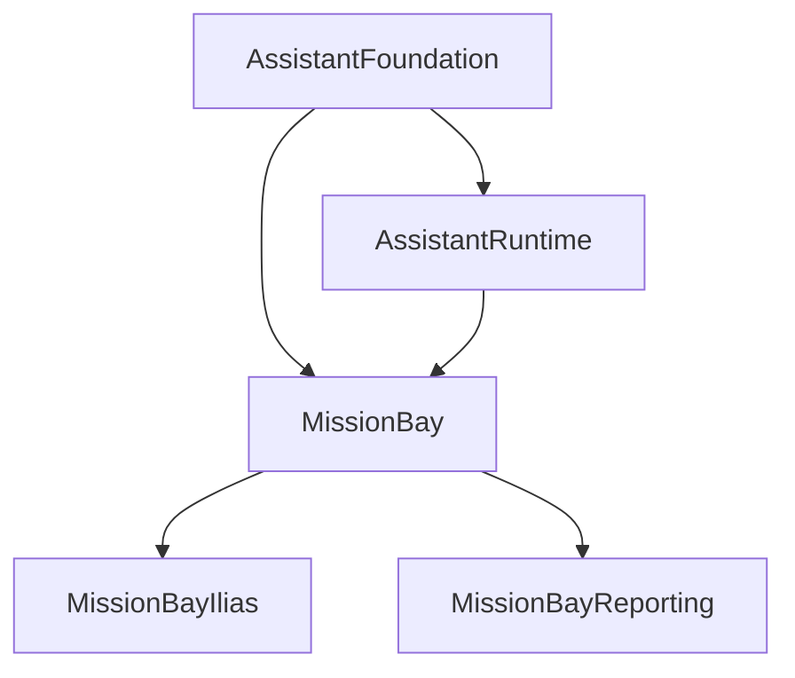

# MissionBay

## Purpose

MissionBay is the BASE3 implementation plugin for configurable AI services, agent execution, AgentFlow processing, tools, retrieval, MCP integration, parsing, speech, and the MissionBay administration surfaces.

It builds on the stable contracts from `AssistantFoundation` and is designed to remain replaceable at the foundation boundary. `AssistantRuntime` can route generic assistant requests to MissionBay without making consumers depend directly on MissionBay implementation classes.

This package contains several related but distinct runtime areas:

* configurable AI connections and service presets
* component presets for reusable agent resources
* compiled MissionBay agent flows
* the staged assistant tool loop
* memory, context, capability and orchestrator profiles
* tool approval, durable suspension and deterministic resume support
* retrieval collections and vector-search resources
* parser, embedding, image, search, STT and TTS services
* inbound and outbound MCP support
* administration displays and service tests
* event-based AI usage and tool auditing
* scheduled agent execution

The most important architectural rule is that MissionBay uses existing BASE3 composition mechanisms. It does not create a parallel container or a second plugin registry.

```text
BASE3 container
  known shared services

BASE3 IClassMap
  discoverable implementations

BASE3 configured components
  configured instances of classmap-discovered implementations

ISettingsStore
  editable MissionBay definitions and profiles

IStateStore
  operational runtime state
```

## Package relationships



`AssistantFoundation` owns stable contracts and DTOs. `AssistantRuntime` owns generic runtime routing and shared runtime services. MissionBay implements the concrete MissionBay runtime. Extension packages such as MissionBayIlias and MissionBayReporting add host or domain-specific behavior.

## Bootstrap and lazy composition

`MissionBayPlugin::init()` is composition code only.

A dedicated test, `MissionBayPluginLazyInitTest`, protects this rule. Plugin initialization must not resolve runtime services from the container. Runtime objects are registered as lazy factories. Configured stage and action-policy definitions are registered as declarative `ComponentDefinition` parameters.

This is significant because MissionBay is used in embedded BASE3 installations where initialization happens during host bootstrap. Service construction, database access, settings loading, network calls, model creation, and request-specific work must happen only when the corresponding service is actually used.

See [docs/bootstrap-and-lazy-composition.md](docs/bootstrap-and-lazy-composition.md).

## Runtime entry points

MissionBay exposes three primary runtime services used by higher-level assistant integrations:

```text
AgentExecutionService
AgentConversationService
AgentTextTaskService
```

`AssistantRuntime` discovers a MissionBay runtime adapter and routes generic foundation requests to the active runtime. MissionBay-specific flow compilation remains inside MissionBay.

Agent compilation starts from settings in the `agent` group. The compiler requires exactly one chat model preset and can apply:

* an orchestrator profile
* one memory profile
* one context profile
* multiple tool profiles
* directly attached component presets
* optional expert capability overrides

The resulting definition contains one `aiassistantnode`, configured resources, docks and the selected stage pipeline.

See [docs/architecture.md](docs/architecture.md), [docs/component-presets.md](docs/component-presets.md), and [docs/agent-stage-pipeline.md](docs/agent-stage-pipeline.md).

## Default staged agent pipeline

When no explicit stage list is supplied, MissionBay activates this ordered pipeline:

```text
capability-discovery
capability-selection
model-decision
action-policy
tool-execution
context-compaction
tool-observation
semantic-verification
```

Additional discoverable stage definitions include `ai-capability-selection` and `final-answer-regenerate`. Availability does not mean automatic activation. The active order comes from the default list or an orchestrator profile.

The detailed agent runtime is documented in:

* [docs/agent-stage-pipeline.md](docs/agent-stage-pipeline.md)
* [docs/agent-orchestration-services.md](docs/agent-orchestration-services.md)
* [docs/agent-capability-catalog-and-selection.md](docs/agent-capability-catalog-and-selection.md)
* [docs/agent-capability-providers-and-modules.md](docs/agent-capability-providers-and-modules.md)
* [docs/agent-effective-composition.md](docs/agent-effective-composition.md)
* [docs/agent-state-and-result.md](docs/agent-state-and-result.md)
* [docs/agent-memory-and-context.md](docs/agent-memory-and-context.md)
* [docs/agent-memory-context-profiles.md](docs/agent-memory-context-profiles.md)

## Approval and mutation safety

MissionBay distinguishes tool capability from authorization to commit a mutation.

The staged path can classify actions, require approval, suspend execution, persist a server-owned suspension handle, resume deterministically, validate action fingerprints and apply a final mutation commit guard.

The relevant documents are:

* [docs/agent-action-approval-and-resume.md](docs/agent-action-approval-and-resume.md)
* [docs/agent-durable-suspensions.md](docs/agent-durable-suspensions.md)
* [docs/agent-mutation-commit-guard.md](docs/agent-mutation-commit-guard.md)
* [docs/agent-tool-development.md](docs/agent-tool-development.md)
* [docs/agent-tool-contract-validation.md](docs/agent-tool-contract-validation.md)

## AgentFlow runtime

MissionBay also provides a general declarative flow runtime. Flow implementations are discoverable through `IClassMap` and created through `IAgentFlowFactory`.

Current flow implementations are:

* `strictflow`
* `dynamicaiflow`

A flow consists of nodes, connections, initial values, resources and dock assignments. Nodes and resources are selected by their stable `getName()` value.

Current factory usage is:

```php
$context = $contextFactory->createContext('agentcontext', null, [
    'source' => 'example'
]);

$flow = $flowFactory->createFromArray(
    'strictflow',
    $definition,
    $context
);

$result = $flow->run([
    'prompt' => 'Explain BASE3.'
]);
```

Do not construct flows through obsolete static `AgentFlow::fromArray()` examples. The factory and `IClassMap` are the current construction boundary.

See [docs/flows-nodes-and-resources.md](docs/flows-nodes-and-resources.md).

## Configured component presets

Reusable resources are stored in the Settings Store group:

```text
agent-component-preset
```

A preset identifies a discoverable resource implementation and may contain configuration, capability declarations and dock references. The canonical materializer creates fresh runtime resources for each top-level materialization and recursively materializes docked presets.

The main services are:

```text
IAgentComponentPresetRepository
IAgentComponentPresetCatalog
IAgentComponentPresetMaterializer
IAgentComponentPresetFlowExpander
IAgentComponentFlowBuilder
```

See [docs/component-presets.md](docs/component-presets.md).

## Connections and configured services

Provider connections live in the `connection` Settings Store group. Service presets reference a connection and a service driver.

Current service groups are:

| Group | Runtime purpose |
| --- | --- |
| `service-llm` | chat model services |
| `service-embedding` | embedding services |
| `service-image` | image generation |
| `service-search` | provider-backed web search |
| `service-vectorsearch` | vector-search services |
| `service-vectorstore` | vector index and inspection services |
| `service-parser` | document parser services |
| `service-stt` | speech-to-text |
| `service-tts` | text-to-speech |

`ConfiguredServiceRuntimeResolver` resolves exactly the configured driver through `IClassMap`, resolves the referenced connection and secret, constructs the implementation and applies runtime options. It does not invent a fallback driver chain.

See [docs/configured-services.md](docs/configured-services.md) and [docs/service-drivers.md](docs/service-drivers.md).

## Retrieval and indexing

MissionBay separates a logical collection key from a physical vector-store collection name.

The mapping is stored in:

```text
retrieval-collection
```

The active embedding composition is stored in:

```text
embedding-orchestrator/default
```

with the fields:

```text
embedding_preset
vector_store_preset
collection_key
```

The collection definition owns schema, representations, agent-visible filter fields and payload projection. A host-specific package may replace `IRetrievalCollectionDefinition`, as MissionBayIlias does.

See [docs/retrieval-and-vector-search.md](docs/retrieval-and-vector-search.md), [docs/parsing-and-indexing.md](docs/parsing-and-indexing.md), and [rag-payload-spec.md](rag-payload-spec.md).

## MCP

MissionBay supports both MCP server and MCP client operation.

Inbound MCP exposes approved tools, resources and prompts through MissionBay catalogs and authorization. Outbound Streamable HTTP MCP servers can be represented by `mcpclientagentresource` and integrated into normal tool profiles.

See [docs/mcp.md](docs/mcp.md) and [docs/mcp-client-agent-resource.md](docs/mcp-client-agent-resource.md).

## Speech

MissionBay provides configured speech services for:

* speech-to-text
* realtime speech-to-text sessions
* text-to-speech

Current provider drivers cover OpenAI and Mistral. Consumers depend on AssistantFoundation speech contracts, while MissionBay resolves the configured service preset.

See [docs/speech.md](docs/speech.md).

## Administration

MissionBay contains administration displays for agents, connections, component presets, composition inspection, LLMs, embeddings, images, parser services, search, vector services, retrieval collections, vector points, retrieval tests, speech, tool profiles, context profiles, memory profiles, orchestrator profiles, logs and user preference definitions.

See [docs/administration.md](docs/administration.md).

## Settings groups

MissionBay currently owns or consumes these editable settings groups:

```text
agent
agent-component-preset
agent-orchestrator-profile
agent-memory-profile
agent-context-profile
tool-profile
connection
service-llm
service-embedding
service-image
service-search
service-vectorsearch
service-vectorstore
service-parser
service-stt
service-tts
retrieval-collection
embedding-orchestrator
```

See [docs/settings-and-configuration.md](docs/settings-and-configuration.md).

## State keys

Operational state is kept outside editable settings. Important prefixes include:

```text
missionbay.agent_tool_result_cache.
missionbay.agent.tool_loop.
```

Session-based conversation memory uses keys beginning with:

```text
base3_missionbay_conversation_memory_chunk_
```

Durable generic assistant suspensions are owned by AssistantRuntime, not MissionBay, and use its own state namespace.

## Events and auditing

MissionBay emits and listens to runtime events for tool starts, tool finishes, failures, action audit records and AI provider usage. Hook listeners attach event listeners during the BASE3 lifecycle.

See [docs/events-hooks-and-auditing.md](docs/events-hooks-and-auditing.md).

## Scheduled execution

`ScheduledAgentRunnerJob` is the MissionBay background job for configured agents. It is discoverable through the BASE3 worker system and reads agent definitions from the `agent` Settings Store group while using the framework job configuration for activation and scheduling behavior.

See [docs/jobs.md](docs/jobs.md).

## Documentation map

### Core MissionBay

* [docs/overview.md](docs/overview.md)
* [docs/architecture.md](docs/architecture.md)
* [docs/bootstrap-and-lazy-composition.md](docs/bootstrap-and-lazy-composition.md)
* [docs/settings-and-configuration.md](docs/settings-and-configuration.md)
* [docs/flows-nodes-and-resources.md](docs/flows-nodes-and-resources.md)
* [docs/component-presets.md](docs/component-presets.md)
* [docs/configured-services.md](docs/configured-services.md)
* [docs/retrieval-and-vector-search.md](docs/retrieval-and-vector-search.md)
* [docs/parsing-and-indexing.md](docs/parsing-and-indexing.md)
* [docs/speech.md](docs/speech.md)
* [docs/administration.md](docs/administration.md)
* [docs/events-hooks-and-auditing.md](docs/events-hooks-and-auditing.md)
* [docs/jobs.md](docs/jobs.md)
* [docs/testing-and-diagnostics.md](docs/testing-and-diagnostics.md)
* [docs/api-reference.md](docs/api-reference.md)
* [docs/component-catalog.md](docs/component-catalog.md)
* [docs/source-map.md](docs/source-map.md)

### Agent runtime

* [docs/agent-stage-pipeline.md](docs/agent-stage-pipeline.md)
* [docs/agent-orchestration-services.md](docs/agent-orchestration-services.md)
* [docs/agent-orchestrator-and-tool-profiles.md](docs/agent-orchestrator-and-tool-profiles.md)
* [docs/agent-capability-catalog-and-selection.md](docs/agent-capability-catalog-and-selection.md)
* [docs/agent-capability-providers-and-modules.md](docs/agent-capability-providers-and-modules.md)
* [docs/agent-effective-composition.md](docs/agent-effective-composition.md)
* [docs/agent-memory-and-context.md](docs/agent-memory-and-context.md)
* [docs/agent-memory-context-profiles.md](docs/agent-memory-context-profiles.md)
* [docs/agent-state-and-result.md](docs/agent-state-and-result.md)
* [docs/agent-action-approval-and-resume.md](docs/agent-action-approval-and-resume.md)
* [docs/agent-durable-suspensions.md](docs/agent-durable-suspensions.md)
* [docs/agent-mutation-commit-guard.md](docs/agent-mutation-commit-guard.md)
* [docs/agent-tool-development.md](docs/agent-tool-development.md)
* [docs/agent-tool-contract-validation.md](docs/agent-tool-contract-validation.md)
* [docs/agent-harness-roadmap.md](docs/agent-harness-roadmap.md)
* [docs/agent-legacy-cleanup.md](docs/agent-legacy-cleanup.md)

### Integrations and providers

* [docs/service-drivers.md](docs/service-drivers.md)
* [docs/image-generation.md](docs/image-generation.md)
* [docs/mcp.md](docs/mcp.md)
* [docs/mcp-client-agent-resource.md](docs/mcp-client-agent-resource.md)
* [rag-payload-spec.md](rag-payload-spec.md)
* [aiprompt.md](aiprompt.md)

## Development rules

When extending MissionBay:

1. Put known shared services in the BASE3 container.
2. Put discoverable implementations behind stable interfaces and `IClassMap` discovery.
3. Use configured component presets when one resource implementation needs multiple configured runtime instances.
4. Keep `MissionBayPlugin::init()` lazy and composition-only.
5. Depend on AssistantFoundation contracts from reusable consumers.
6. Keep host-specific behavior in host extension packages.
7. Keep operational state in `IStateStore`, not in editable settings.
8. Keep service and connection definitions in `ISettingsStore`.
9. Resolve secrets through configuration-value or credential boundaries rather than copying secret material into runtime profiles.
10. Preserve mandatory server-side authorization filters independently from agent-requested filters.

## License

GPL-3.0.
