# MissionBay Agent Stage Pipeline

## Purpose

This document describes the active MissionBay assistant pipeline, its explicit configuration point, and the two-phase response model.

For every stage it states:

- what the stage does;
- why the stage is placed at that exact position;
- whether it uses AI;
- which context state must exist before execution;
- which context state exists after execution;
- whether the stage is active in the default pipeline.

---

## 1. Where is the executed pipeline defined?

There are two different configurations. They must not be confused.

### Available stage components

`MissionBayPlugin::registerDefaultAgentStageDefinitions()` registers configured `IAgentStage` components. This makes a stage resolvable through `IComponentResolver`; it does **not** activate the stage and does not define an order.

### Active default pipeline

The ordered default pipeline is defined explicitly in:

```text
MissionBay\MissionBayPlugin::DEFAULT_AGENT_STAGE_IDS
```

`MissionBayPlugin` passes this ordered list into `AgentStagePipelineResolver`. There is no second hard-coded default list inside the resolver or orchestrator. `AgentToolOrchestrator` requires the composition layer to supply an ordered pipeline.

When an assistant node receives no `stages` input, this plugin-defined list is used. A non-empty node input overrides the default for that agent-flow run:

```php
[
    'stages' => [
        'budget-guard',
        'model-decision',
        'action-policy',
        'tool-cache-lookup',
        'tool-budget-guard',
        'tool-execution',
        'context-assessment',
        'result-verification',
        'tool-cache-store',
        'tool-observation',
        'loop-progress',
        'semantic-verification',
        'continuation-decision',
        'final-budget-guard',
    ],
]
```

The complete resolution path is:

```text
AgentFlow node input `stages`
  -> AbstractAiAssistantNode
  -> AgentAssistantTurnOptions
  -> AgentAssistantTurnService
  -> AgentStagePipelineResolver
  -> IComponentResolver
  -> ordered IAgentStage instances
  -> AgentToolOrchestrator
```

Installing or registering another stage never activates it automatically. Activation always comes from either the plugin default list or the explicit node input.

---

## 2. Current default pipeline

```text
budget-guard
  -> model-decision
  -> action-policy
  -> tool-cache-lookup
  -> tool-budget-guard
  -> tool-execution
  -> context-assessment
  -> result-verification
  -> tool-cache-store
  -> tool-observation
  -> loop-progress
       -> progress: next loop iteration
       -> exact repeated read-only evidence: terminal candidate

When model-decision later returns no tool calls:
  -> semantic-verification (once, only for this terminal candidate)
  -> continuation-decision
       -> continue: reopen the tool loop
       -> answer/clarify/inconclusive: keep the terminal decision
  -> final-budget-guard
  -> orchestration ends
  -> final response generation starts outside the tool loop
```

`context-compaction` remains optional because it is lossy and performs an additional AI request. `semantic-verification` is active in the MissionBay default pipeline, but it now runs only once after `model-decision` has already requested tool-phase completion. It no longer doubles every tool-loop iteration.

### Two-phase response model

MissionBay deliberately separates tool control from user-visible answer generation:

```text
Phase 1: tool loop
  model-decision uses complete(..., tools)
  terminal response is instructed to return only `TOOL_PHASE_COMPLETE`
  the temporary control instruction is not persisted in the working messages
  no user-visible answer is streamed from this call

Phase 2: final response
  the complete working message stack is passed to the model without tools
  StreamingAiAssistantNode uses streamResult(...)
  AiAssistantNode uses complete(...)
```

The second model call is therefore not an accidental duplicate. It is the dedicated answer-generation phase and preserves token streaming for the chatbot. `final-budget-guard` executes before this phase begins.


### Recoverable loop-limit termination

Reaching `maxtoolloops` is not treated like malformed provider data, a denied action, or an exhausted hard budget. The orchestration result remains incomplete and keeps the stable failure code `max_tool_loops`, but its final-response mode becomes `partial`.

The assistant node then starts the normal buffered or streaming final-response phase with the complete working message stack collected so far. A transient system instruction tells the model to:

- answer from the available observations;
- state which conclusions remain incomplete or uncertain;
- avoid claiming that further tools were executed;
- avoid exposing internal runtime control data.

The transient recovery instruction is not persisted in memory. The visible partial answer is persisted as normal chat history, so a later user turn can continue from the information already communicated.

Other failures keep final-response mode `none` and continue to use the deterministic fallback path. This distinction prevents a provider error or a hard budget failure from being presented as a normal synthesized answer.

### Persistent tool-log events

`tool-execution` emits the existing domain events through the shared `IEventManager`:

```text
MissionBayToolStartedEvent
MissionBayToolFinishedEvent
MissionBayToolFailedEvent
```

`AgentToolExecutionStage` requires `IEventManager` as a non-null constructor dependency. This is important because BASE3 constructor autowiring intentionally uses the default value of nullable constructor parameters; a nullable `?IEventManager = null` would therefore disable these events even when the shared service exists.

`MissionBayToolEventRegistrationHookListener` connects the domain events to `MissionBayToolEventDisplayListener` after `bootstrap.migrated`. The database-backed tool log therefore remains separate from the live EventTransport messages used by the chatbot.

### Overview

| Stage | Responsibility | Why it is here | AI usage | Default |
|---|---|---|---|---|
| `budget-guard` | Evaluates accumulated normalized AI usage, AI-operation count, elapsed time, and generic usage metrics before a model call. | It prevents a new model request when the run has already exhausted its budget. | None | Yes |
| `model-decision` | Calls the active chat model and produces either tool calls or a terminal stop decision. | The loop first needs a decision about what to do. It is instructed to return only the short `TOOL_PHASE_COMPLETE` control signal when no further tool call is needed. This is not the visible streamed answer. | Required | Yes |
| `action-policy` | Converts requested tool calls into semantic actions and evaluates configured policies. | A model request must not directly authorize side effects. | Depends on policies; default none | Yes |
| `tool-cache-lookup` | Reuses explicitly configured safe tool results by stable tool identity, canonical arguments, scope, and TTL. | Cache hits must be resolved after action policy but before tool-budget projection and execution. | None | Yes, skipped unless configured |
| `tool-budget-guard` | Rechecks updated usage after the model call and validates the projected number of allowed tool calls. | A model call can cross a limit or request too many tools; both must be stopped before any tool executes. | None | Yes |
| `tool-execution` | Executes only allowed calls and creates normalized `AgentToolResult` objects. | Execution requires an allowed action and a successful tool budget checkpoint. | None | Yes |
| `context-assessment` | Measures raw message/result size, result counts, and provider-reported usage. | Raw results must be measured before transformations. | None | Yes |
| `context-compaction` | Summarizes oversized successful tool outputs. | Compaction must happen after raw measurement and before verification/observation. | Conditional | No |
| `result-verification` | Verifies the final normalized tool-result contract before results become observations. | Invalid or uncorrelated results must not enter the next model context. | None | Yes |
| `tool-cache-store` | Stores only successful results after structural verification and below the configured entry-size limit. | Unverified, failed, oversized, or non-opted-in results must never enter the cache. | None | Yes, skipped unless configured |
| `tool-observation` | Commits verified current results to `OBSERVATIONS` and the model message stack. | Every successful tool iteration must finish by making its evidence available to the next model decision and the final response. | None | Yes |
| `loop-progress` | Detects exact repeated successful read-only calls with equivalent arguments and unchanged outputs. | It runs after observations are committed so it can compare the latest accepted evidence against earlier iterations without suppressing any tool execution. | None | Yes |
| `semantic-verification` | Validates a terminal `model-decision` against all accumulated observations and recommends `answer`, `continue`, or `clarify`. | It runs only after the primary model has already chosen to stop, so semantic checking does not add another AI call to every tool iteration. | Required, once per terminal candidate | Yes |
| `continuation-decision` | Keeps the terminal decision unless the verifier gives a high-confidence reason to continue or clarify. | Invalid, missing, or low-confidence verifier output must not trap the agent in repeated loops. | None | Yes |
| `final-budget-guard` | Rechecks accumulated usage before the dedicated final response call. | The visible answer must not start after the configured budget has already been exhausted. | None | Yes |

---

## 3. Loop and phase model

At the start of each iteration, `AgentToolOrchestrator`:

1. increments `ITERATION`;
2. sets `PHASE` to `model`;
3. evaluates the configured stages in order;
4. records a skipped trace entry when `supports()` returns `false`;
5. emits `stage.started` for a supported stage;
6. calls `process()`;
7. immediately applies the returned `AgentStageResult` patch;
8. emits `stage.finished` or `stage.error`.

A later stage always sees the context produced by earlier stages in the same iteration.

```mermaid
flowchart LR
    A[iteration starts<br/>phase=model] --> BG[budget-guard]
    BG -->|budget available| B[model-decision]
    BG -->|limit exceeded or strict usage unknown| X[phase=failed]
    B -->|tool calls| C[phase=tools]
    B -->|no tool calls| Q[phase=final / terminal candidate]
    C --> D[action-policy]
    D -->|allowed actions| CL[tool-cache-lookup]
    CL -->|misses remain| TBG[tool-budget-guard]
    CL -->|all hits| F
    D -->|all actions blocked| F[phase=after-tools]
    TBG -->|budget available| E[tool-execution]
    TBG -->|limit exceeded or strict usage unknown| X
    E --> F
    F --> G[context-assessment]
    G --> H{context-compaction configured<br/>and output large?}
    H -->|yes| I[context-compaction]
    H -->|no| J[result-verification]
    I --> J
    J -->|contract failure| X[phase=failed]
    J -->|verified| CS[tool-cache-store]
    CS --> O[tool-observation]
    O --> LP{loop-progress exact repeat?}
    LP -->|new evidence or unsafe to classify| L[phase=observed]
    LP -->|yes| Q
    L --> M[next iteration]
    Q --> K{observations exist and semantic verifier configured?}
    K -->|yes| N[semantic-verification once]
    K -->|no| FBG[final-budget-guard]
    N --> CD[continuation-decision]
    CD -->|high-confidence continue| M
    CD -->|answer, clarify, invalid, or low confidence| FBG
    FBG --> Z[tool loop complete]
    Z --> OUT[assistant node final response phase]
```



---

## 3.1 Terminal verification and latency

The semantic verifier is deliberately not a per-tool-result stage anymore.

Previous behavior:

```text
one model-decision call
+ one semantic-verification call
for every tool iteration
```

Current behavior:

```text
one model-decision call per tool iteration
semantic-verification only after model-decision returns TOOL_PHASE_COMPLETE
```

The primary model remains responsible for normal loop progress. Semantic verification is a terminal guard. Only an explicit `continue` recommendation with confidence at or above `minContinueConfidence` reopens the loop. Invalid JSON, missing confidence, `inconclusive`, or a low-confidence recommendation keeps the primary terminal decision and proceeds to the final response.

The default thresholds are:

```text
answer:   0.75
clarify:  0.75
continue: 0.70
```

Verifier output parsing accepts the documented schema, common equivalent field names, nested result objects, decimal confidence, and percentage confidence. Parse status and the normalized verification are included in stage metadata for diagnosis.

## 4. Runtime context keys

The current keys are defined in:

```text
MissionBay\Orchestrator\Stage\AgentToolLoopContextKeys
```

They use the prefix:

```text
missionbay.agent.tool_loop.
```

These keys describe the current MissionBay orchestration runtime. They are not yet the final shared `AgentState` model.

| Key | Initial value | Meaning |
|---|---:|---|
| `MODEL` | `IAiChatModel` | Active normalized chat model. |
| `MESSAGES` | `array` | Working model-message stack. |
| `TOOL_DEFINITIONS` | `array` | Tool schemas supplied to the model. |
| `TOOLS` | `array` | Runtime tool implementations. |
| `EVENT_CALLBACK` | `callable|null` | Optional live event sink. |
| `LOGGER` | `ILogger|null` | Per-run logger. |
| `NODE_ID` | `string` | Assistant node id. |
| `TRACE` | `array` | Turn and chatbot identifiers. |
| `MAX_LOOPS` | `int` | Maximum model/tool iterations. |
| `BUDGET` | `AgentBudget` | Run-specific exact limits; unlimited when no limits are configured. |
| `TOOL_CACHE_CONFIG` | `AgentToolCacheConfig` | Explicit run-specific cache rules; disabled by default. |
| `RUN_STARTED_AT` | `int` | Monotonic nanosecond timestamp used for elapsed-time checks. |
| `PHASE` | `model` | Current loop phase. |
| `ITERATION` | `0` | Current loop iteration. |
| `CALL_INDEX` | `0` | Monotonic tool-call index. |
| `PENDING_TOOL_CALLS` | `[]` | Normalized calls awaiting policy/execution. |
| `ACTIONS` | `[]` | Semantic actions created from tool calls. |
| `ACTION_DECISIONS` | `[]` | Ordered policy decisions. |
| `TOOL_RESULTS` | `[]` | Current normalized results awaiting observation. |
| `OBSERVATIONS` | `[]` | Results already committed as observations. |
| `EXECUTED_TOOL_CALLS` | `[]` | Backwards-compatible logical tool-call debug data; cached calls are marked and excluded from execution-count budgets. |
| `TOOL_CALL_INDEXES` | `[]` | Stable call-index assignments preserving model call order across cache hits and misses. |
| `TOOL_CACHE_PLANS` | `[]` | Internal validated cache-key and TTL plans for current/future store operations. |
| `TOOL_CACHE_RECORDS` | `[]` | Immutable cache hit, miss, bypass, store, skip, and error records. |
| `PROGRESS_ASSESSMENTS` | `[]` | Immutable deterministic assessments describing progress, stalling, and exact repeated evidence. |
| `CONSECUTIVE_STALLED_ITERATIONS` | `0` | Internal count of consecutive exact repeat-only iterations. |
| `LOOP_PROGRESS_TERMINATED` | `false` | Internal marker that prevents semantic verification from reopening a deterministically stalled loop. |
| `FINAL_ASSISTANT_MESSAGE` | `null` | Terminal assistant message that ended the tool phase. |
| `FINAL_OUTPUT_CONTENT` | `''` | Optional stage-owned output. It remains empty in the default two-phase node path. |
| `FINAL_RESPONSE_MODE` | `none` | Output disposition: `complete`, recoverable `partial`, or `none`. |
| `MODEL_RESULTS` | `[]` | Metadata from every AI call inside the loop. |
| `CONTEXT_ASSESSMENTS` | `[]` | Structural context measurements. |
| `CONTEXT_COMPACTIONS` | `[]` | Compaction attempts. |
| `RESULT_VERIFICATIONS` | `[]` | Deterministic and semantic verification records. |
| `CONTINUATION_DECISIONS` | `[]` | Immutable `continue`, `answer`, or `clarify` decisions. |
| `CONTINUATION_HINT` | `''` | Transient guidance added only to the next model-decision request. |
| `FINAL_RESPONSE_INSTRUCTION` | `''` | Transient guidance added only to the dedicated final response request. |
| `BUDGET_ASSESSMENTS` | `[]` | Immutable model and tool budget checkpoints. A tool-producing iteration records both; a terminal iteration records only the model checkpoint. |
| `STAGE_TRACE` | `[]` | Executed, skipped, and failed stage decisions. |
| `COMPLETED` | `false` | Normal completion flag. |
| `FAILURE_CODE` | `''` | Stable failure code. |
| `FAILURE_MESSAGE` | `''` | Human-readable failure message. |
| `FAILURE_DETAIL` | `[]` | Structured failure details. |

---

## 4.1 Stages: `tool-cache-lookup` and `tool-cache-store`

Both configured components use:

```text
MissionBay\Orchestrator\Stage\AgentToolResultCacheStage
```

They are active in the default ordered pipeline, but `supports()` returns false unless the node input `toolcache` explicitly enables caching and provides at least one exact tool rule. There is no implicit cache allowlist.

### Lookup checkpoint

Position:

```text
action-policy
  -> tool-cache-lookup
  -> tool-budget-guard
  -> tool-execution
```

The action policy always runs first, including for a possible cache hit. The lookup stage then:

1. resolves the concrete tool implementation/resource identity;
2. finds an exact configured rule by tool function, optional resource id, and optional implementation name;
3. canonicalizes nested arguments by sorting associative keys while preserving list order;
4. derives the configured scope;
5. builds a versioned SHA-256 key from namespace, tool identity, function, arguments, scope, and rule variant;
6. returns a normalized `AgentToolResult` on a valid hit;
7. leaves misses in `PENDING_TOOL_CALLS` for the normal budget guard and executor.

When every allowed call is a hit, the stage moves directly to `PHASE_AFTER_TOOLS`; neither `tool-budget-guard` nor `tool-execution` runs. Cache hits remain visible as tool activity and persistent tool-log entries marked `cached`.

### Store checkpoint

Position:

```text
result-verification
  -> tool-cache-store
  -> tool-observation
```

The store checkpoint requires a successful current `result-verification`. It stores only fresh successful results that have a prior cache plan. It never stores:

- policy-blocked calls;
- tool failures or exceptions;
- unverified results;
- results without an explicit matching rule;
- results larger than `max_entry_bytes`;
- cache hits again.

Cache errors are fail-open. They are recorded and logged but do not fail the agent run.

### Backend

The shared contract is:

```text
AssistantFoundation\Api\IAgentToolResultCache
```

MissionBay provides a TTL implementation backed by `IStateStore`. If no state store is available, a no-op backend is wired and both cache stages skip themselves. This keeps BASE3 operational without a database.

### Configuration

Example node input:

```php
[
    'toolcache' => [
        'enabled' => true,
        'scope' => 'configuration',
        'key_namespace' => 'chatbot-v1',
        'max_entry_bytes' => 262144,
        'tools' => [
            'general_info' => 60,
            'procedural_memory_get_applicable' => [
                'ttl_seconds' => 300,
                'variant' => 'memory-schema-v1',
            ],
        ],
    ],
]
```

Equivalent detailed rules may use `rules`:

```php
[
    'toolcache' => [
        'enabled' => true,
        'scope' => 'chatbot',
        'rules' => [
            [
                'tool' => 'general_info',
                'ttl_seconds' => 60,
                'resource_id' => 'general-info-primary',
                'implementation' => 'generalinfoagenttool',
            ],
        ],
    ],
]
```

Supported scopes:

```text
global
configuration   default: config group + config name
chatbot         resolved chatbot key
turn            current turn only
custom          explicit scope_key
```

`global` should be used only for results that are independent of tenant, user, session, authorization, and runtime configuration. Cache rules are a trust boundary: adding a side-effecting or user-sensitive tool to a broad scope is a composition error.

The cache backend stores creation time, expiry time, tool identity, argument hash, scope, output, and provenance metadata. `orchestrator_tool_cache_records` exposes serializable diagnostics after the run.

## 5. Stages: `budget-guard` and `tool-budget-guard`

Both configured components use the same deterministic implementation:

```text
MissionBay\Orchestrator\Stage\AgentBudgetGuardStage
```

They are mounted at two different safety boundaries. The checkpoint is a
component parameter, not provider-specific logic.

```text
budget-guard       checkpoint=model
tool-budget-guard  checkpoint=tools
```

### Shared responsibility

The stages read the run-specific `AgentBudget` and aggregate exact counters
from normalized runtime state. Supported limits are:

```text
max_input_tokens
max_output_tokens
max_total_tokens
max_ai_operations
max_tool_calls
max_elapsed_ms
metric_limits
require_usage_reporting
```

`metric_limits` uses the generic `AiUsage.metrics` map. The same budget can
therefore constrain non-chat units such as generated images, search queries,
vector items, audio seconds, or provider-reported monetary cost.

```php
[
    'budget' => [
        'max_total_tokens' => 120000,
        'max_ai_operations' => 20,
        'max_tool_calls' => 30,
        'max_elapsed_ms' => 120000,
        'metric_limits' => [
            'output_images' => 4,
            'search_queries' => 12,
            'cost_usd' => 2.5,
        ],
        'require_usage_reporting' => true,
    ],
]
```

A zero, empty, or missing limit means unlimited. Negative limits are rejected.
The default budget is unlimited, so installing this patch does not impose new
limits unless the node or flow supplies a `budget` input.

Every completed budget checkpoint now publishes its exact assessment through
`AgentStageResult` metadata. The Chatbot displays configured totals directly
in the stage row, for example `tokens 1840/100000`, `AI ops 2/12`,
`tools 2/20`, and elapsed time. An unlimited configuration is shown as
`budget unlimited`. Exceeded and unknown dimensions are named explicitly.

### AI usage

None. Both checkpoints perform only deterministic arithmetic over normalized
runtime metadata.

### Checkpoint 1: `budget-guard`

#### What it does

The model checkpoint runs at the beginning of each loop iteration. It checks:

- accumulated provider-reported token and generic usage;
- completed AI-operation count;
- exact elapsed run time.

It deliberately does not project tool calls because the current model decision
has not happened yet.

#### Why it is first

It must run while `PHASE == model`, before `model-decision`:

```text
previously accumulated usage
  -> budget-guard
  -> model-decision only when another AI operation may start
```

Placing it after `model-decision` would allow an already exhausted run to make
one more provider request.

#### Input requirements

`supports()` returns `true` when:

```text
PHASE == model
COMPLETED != true
FAILURE_CODE == ''
```

It reads:

```text
BUDGET
MODEL_RESULTS
EXECUTED_TOOL_CALLS
RUN_STARTED_AT
ITERATION
BUDGET_ASSESSMENTS
```

#### Successful output

```text
BUDGET_ASSESSMENTS += AgentBudgetAssessment(checkpoint=model)
PHASE remains model
```

Messages, actions, calls, and results remain unchanged. `model-decision` can
run next.

### Checkpoint 2: `tool-budget-guard`

#### What it does

The tool checkpoint runs after `model-decision` and `action-policy`. It sees the
usage of the model call that just completed and the exact set of allowed pending
tool calls. It checks:

- all token, AI-operation, elapsed-time, and generic metric limits again;
- `current executed tool calls + pending allowed tool calls` against
  `max_tool_calls`.

This is a pre-execution projection. Blocked policy actions do not count as
pending executable calls.

#### Why it is between policy and execution

```text
model-decision
  -> action-policy determines which calls are allowed
  -> tool-budget-guard checks updated usage and projected allowed calls
  -> tool-execution performs only approved and budgeted work
```

A model request can itself cross a token or operation limit. It can also return
several tool calls at once. Waiting until the next loop iteration would execute
those calls before noticing the overrun.

#### Input requirements

`supports()` returns `true` when:

```text
PHASE == tools
COMPLETED != true
FAILURE_CODE == ''
```

It reads the same accumulated state as the model checkpoint plus:

```text
PENDING_TOOL_CALLS
```

#### Successful output

```text
BUDGET_ASSESSMENTS += AgentBudgetAssessment(checkpoint=tools)
PHASE remains tools
```

`tool-execution` can run next.

### Failure output at either checkpoint

When a configured limit is exhausted or the projected tool-call count exceeds
its limit:

```text
FAILURE_CODE    = agent_budget_exceeded
FAILURE_MESSAGE = checkpoint-specific stable message
FAILURE_DETAIL  = serialized AgentBudgetAssessment
COMPLETED       = false
PHASE           = failed
```

All later stages are skipped by their `supports()` checks. At the tool
checkpoint, no pending tool is executed.

### Unknown provider usage

Missing provider usage is never interpreted as zero. Each assessment records
unknown configured dimensions separately.

When `require_usage_reporting` is `false`, unknown dimensions remain visible
but do not block execution. When it is `true`, either checkpoint fails with:

```text
agent_budget_usage_unknown
```

This enables strict usage control without estimating provider consumption.

### Exact limitations of the current checkpoints

The model checkpoint cannot predict the cost of the next provider call. The
tool checkpoint catches a resulting overrun before tool execution, but the
already completed model request cannot be undone.

The final response model call happens outside the tool-loop stage pipeline, but `final-budget-guard` performs a preflight check immediately before the orchestration result is returned to the node. As with every preflight check, it cannot predict the exact cost of the upcoming provider call; a provider may therefore cross a limit during the final response itself. The resulting normalized usage is still recorded in the turn result.

---

## 6. Stage: `model-decision`

Implementation:

```text
MissionBay\Orchestrator\Stage\AgentModelDecisionStage
```

### What it does

It performs one provider-neutral chat-model completion:

```php
$model->complete($messages, $toolDefinitions)
```

It consumes `AiChatResult`, not provider-native response structures. It either:

- produces normalized `AiToolCall` objects; or
- produces a terminal assistant message and completes the tool phase.

Provider-reported metadata and usage are appended to `MODEL_RESULTS`.

### Why it is first

Nothing can be executed or assessed until the model has decided whether a tool action is needed.

### AI usage

**Required.** Every execution performs exactly one chat-model call.

### Entry requirements

```text
PHASE == model
COMPLETED != true
FAILURE_CODE == ''
MODEL is IAiChatModel
MESSAGES is an array
TOOL_DEFINITIONS is an array
```

### Exit: tools requested

```text
MESSAGES           += assistant tool-call message
MODEL_RESULTS      += model metadata
PENDING_TOOL_CALLS  = AiToolCall[]
PHASE               = tools
```

### Exit: terminal response

```text
FINAL_ASSISTANT_MESSAGE = assistant message
MODEL_RESULTS          += model metadata
PENDING_TOOL_CALLS      = []
PHASE                   = final
COMPLETED               = true
```

---

## 7. Stage: `action-policy`

Implementation:

```text
MissionBay\Orchestrator\Stage\AgentActionPolicyStage
```

### What it does

It converts every `AiToolCall` into a provider-neutral `AgentAction` and evaluates configured `IAgentActionPolicy` components.

All configured policies must allow an action. The first non-allow decision blocks it.

Supported decisions:

```text
allow
deny
require_approval
require_dry_run
require_clarification
```

A blocked action is not executed. The stage creates a failed `AgentToolResult` so later stages and the next model decision can see the policy outcome.

The default `allow-all-actions` policy preserves existing behavior while keeping the safety boundary explicit.

### Why it follows `model-decision`

The model proposes an action. A policy decides whether the runtime may execute it. Tool code must not run between those two steps.

### AI usage

**Depends on configured policies.** The default policy uses no AI.

### Entry requirements

```text
PHASE == tools
PENDING_TOOL_CALLS contains AiToolCall objects
COMPLETED != true
FAILURE_CODE == ''
```

### Exit

```text
ACTIONS              += AgentAction[]
ACTION_DECISIONS      += AgentActionDecision[]
PENDING_TOOL_CALLS     = allowed calls only
TOOL_RESULTS          += blocked-action results
PHASE                  = tools when calls remain
PHASE                  = after-tools when all calls are blocked
```

---

## 8. Stage: `tool-execution`

Implementation:

```text
MissionBay\Orchestrator\Stage\AgentToolExecutionStage
```

### What it does

For every allowed `AiToolCall`, it:

1. finds the matching `IAgentTool`;
2. emits `tool.started`;
3. executes the tool;
4. emits `tool.finished` or `tool.error`;
5. creates one normalized `AgentToolResult`;
6. updates backwards-compatible tool-call debug data.

It does not add output to `MESSAGES`.

### Why it follows `action-policy`

Only policy-approved actions may cause tool side effects.

### AI usage

**None at stage level.** A tool may internally use AI, but that is tool behavior and must report its own normalized usage.

### Entry requirements

```text
PHASE == tools
PENDING_TOOL_CALLS is a non-empty AiToolCall[]
COMPLETED != true
FAILURE_CODE == ''
```

### Exit

```text
PENDING_TOOL_CALLS  = []
TOOL_RESULTS        = AgentToolResult[]
EXECUTED_TOOL_CALLS = updated debug data
CALL_INDEX          = updated index
PHASE               = after-tools
```

A tool failure is a valid failed `AgentToolResult`; it does not automatically fail the whole agent run.

---

## 9. Stage: `context-assessment`

Implementation:

```text
MissionBay\Orchestrator\Stage\AgentContextAssessmentStage
```

### What it does

It records:

- message count and serialized bytes;
- tool-result count and serialized bytes;
- successful and failed result counts;
- cumulative provider-reported AI usage.

It does not estimate tokens and does not modify messages or results.

### Why it follows `tool-execution`

It must measure the raw result set before compaction or another transformation changes its size.

### AI usage

**None.** This is deterministic measurement.

### Entry requirements

```text
PHASE == after-tools
TOOL_RESULTS is a non-empty AgentToolResult[]
COMPLETED != true
FAILURE_CODE == ''
```

### Exit

```text
CONTEXT_ASSESSMENTS += AgentContextAssessment
TOOL_RESULTS         unchanged
MESSAGES             unchanged
PHASE                unchanged: after-tools
```

---

## 10. Optional stage: `context-compaction`

Implementation:

```text
MissionBay\Orchestrator\Stage\AgentContextCompactionStage
```

### What it does

For each oversized successful tool result, it calls the active normalized chat model and replaces only the result output with a factual compact representation.

It preserves call id, tool name, arguments, status, and metadata. Failed or small results remain unchanged. A failed compaction keeps the original output and does not fail the run.

### Why it follows `context-assessment`

Raw size and usage must be measured before content is reduced.

### Why it precedes `result-verification`

Verification must validate the exact result objects that will later be committed. If compaction changes a result, verification must see the compacted form and confirm that identity and status contracts remain intact.

### AI usage

**Conditional.** It calls the chat model only for successful outputs above the configured threshold.

Default component parameters:

```text
minimum tool-result size: 12000 bytes
maximum compaction input: 80000 bytes
target summary length:    4000 characters
```

### Entry requirements

```text
PHASE == after-tools
at least one successful result exceeds the threshold
COMPLETED != true
FAILURE_CODE == ''
```

### Exit

```text
TOOL_RESULTS         = original and/or compacted results
MODEL_RESULTS       += compaction model metadata
CONTEXT_COMPACTIONS += compaction records
PHASE                unchanged: after-tools
```

---

## 11. Stage: `result-verification`

Implementation:

```text
MissionBay\Orchestrator\Stage\AgentResultVerificationStage
```

### What it does

This stage performs deterministic structural verification of the final tool-result set before observation.

It checks:

- every item is an `AgentToolResult`;
- call ids are present and unique;
- tool names are present;
- result status is supported;
- failed results contain an error code and error message;
- when current `AgentAction` records are available, every action has exactly one corresponding result and no unexpected result exists.

It writes one `AgentResultVerification` record to `RESULT_VERIFICATIONS`.

It intentionally does **not** decide whether the tool information is factually correct, sufficient for the user's task, or contradictory. That is semantic verification and requires a separate optional AI stage.

### Why it follows all result transformations

Compaction, filtering, enrichment, or normalization stages may replace result objects. Structural verification must inspect the final form that is about to be committed.

### Why it precedes `tool-observation`

`tool-observation` writes results into the persistent working message stack. Invalid or uncorrelated results must be rejected before that commit boundary.

### AI usage

**None.** All checks are deterministic.

### Entry requirements

```text
PHASE == after-tools
TOOL_RESULTS is a non-empty array
COMPLETED != true
FAILURE_CODE == ''
```

Optional correlation input:

```text
ACTIONS contains current-iteration AgentAction records
```

When a custom pipeline omits `action-policy`, action correlation is skipped, but the result contract is still checked.

### Exit: verified

```text
RESULT_VERIFICATIONS += verified AgentResultVerification
TOOL_RESULTS           unchanged
MESSAGES               unchanged
PHASE                  unchanged: after-tools
```

### Exit: contract failure

```text
RESULT_VERIFICATIONS += failed AgentResultVerification
FAILURE_CODE           = tool_result_verification_failed
FAILURE_DETAIL         = structured verification record
PHASE                  = failed
COMPLETED              = false
```

`tool-observation` is then skipped because the run has failed.

---

## 12. Stage: `semantic-verification`

Implementation:

```text
MissionBay\Orchestrator\Stage\AgentSemanticVerificationStage
```

### What it does

This stage validates a terminal tool-phase decision. It runs only after
`model-decision` has returned no tool calls and has already marked the tool
phase complete.

The verifier receives:

- the current user task;
- all normalized `OBSERVATIONS` accumulated during previous tool iterations;
- no provider-native response structures;
- no tool access.

It returns a normalized `AgentResultVerification` with:

```text
verdict:        verified | failed | inconclusive
recommendation: answer | continue | clarify
confidence:     0.0 .. 1.0 or unknown
```

The stage does not execute tools, mutate observations, or generate the visible
answer. Its model metadata and provider-reported usage are appended to
`MODEL_RESULTS`.

### Why it runs only after terminal `model-decision`

The primary model already decides normal tool-loop progress. Running another
semantic model call after every tool result doubled the latency of each loop
without reliably changing control flow.

The current sequence is:

```text
tool iteration
  -> model-decision
  -> tools and deterministic checks
  -> tool-observation
  -> next iteration

terminal iteration
  -> model-decision returns TOOL_PHASE_COMPLETE
  -> semantic-verification runs once
  -> continuation-decision may reopen the loop
```

This keeps normal tool gathering fast while retaining one semantic safeguard
before final response generation.

### AI usage

**Required when the stage runs.** It performs one normalized chat-model call per
terminal candidate, not one call per tool iteration.

### Entry requirements

```text
PHASE == final
COMPLETED == true
OBSERVATIONS is a non-empty AgentToolResult[]
FAILURE_CODE == ''
```

A tool-free request with no observations skips semantic verification and keeps
the primary model's terminal decision.

### Model input and parsing

The verifier receives an isolated two-message request with a strict JSON schema.
The parser accepts the documented schema plus common equivalent field names,
nested `assessment`, `verification`, or `result` objects, decimal confidence,
and percentage confidence.

Default component limits:

```text
maximum verifier input: 60000 bytes
maximum task text:      12000 bytes
```

The normalized verification and `parse_status` are attached to stage metadata.
Malformed output is recorded as `inconclusive`; it does not fail the run.

### Exit

```text
MODEL_RESULTS        += verifier model metadata and usage
RESULT_VERIFICATIONS += semantic AgentResultVerification
PHASE                  remains final
COMPLETED              remains true
```

Only `continuation-decision` may reopen the loop after this point.

---

## 13. Stage: `tool-observation`

Implementation:

```text
MissionBay\Orchestrator\Stage\AgentToolObservationStage
```

### What it does

For every verified current result, it:

1. appends the `AgentToolResult` to `OBSERVATIONS`;
2. materializes its current output as a `role=tool` message;
3. associates the message with the original tool call id;
4. clears `TOOL_RESULTS`.

### Why it follows result verification

Observation is the commit boundary. Assessment, compaction, structural
verification, filtering, and enrichment must happen before it. Once committed,
the evidence is available to the next `model-decision` and to the final response.
Semantic terminal verification happens later, only after the primary model has
requested tool-phase completion.

### AI usage

**None.** It only commits normalized data.

### Entry requirements

```text
PHASE == after-tools
TOOL_RESULTS is a non-empty AgentToolResult[]
COMPLETED != true
FAILURE_CODE == ''
```

### Exit

```text
MESSAGES      += role=tool messages
OBSERVATIONS  += current AgentToolResult objects
TOOL_RESULTS   = []
PHASE          = observed
```

The next loop iteration resets `PHASE` to `model`.

---

## 13.1 Stage: `loop-progress`

Implementation:

```text
MissionBay\Orchestrator\Stage\AgentLoopProgressStage
```

### What it does

The stage compares the latest committed observations with earlier observations
from the same run. It classifies an iteration as stalled only when all current
results are:

- successful;
- produced by tools explicitly marked repeat-safe through `readOnlyHint` or a
  `readonly` tool tag;
- called with the same canonically normalized arguments as an earlier call;
- byte-equivalent after canonical output normalization.

It never removes, skips, or rewrites a tool call. The repeated call has already
executed and remains visible in the tool log.

### Why it follows `tool-observation`

The stage must compare accepted evidence, not raw or unverified results. Running
after the observation commit boundary also guarantees that a terminal final
response still receives the latest tool result.

### AI usage

**None.** The comparison is deterministic.

### Entry requirements

```text
PHASE == observed
COMPLETED != true
FAILURE_CODE == ''
```

### Exit: progress

```text
PROGRESS_ASSESSMENTS += verdict=progress
CONSECUTIVE_STALLED_ITERATIONS = 0
PHASE remains observed
```

### Exit: exact repeated evidence

With the default threshold of one repeat-only iteration:

```text
PROGRESS_ASSESSMENTS += verdict=stalled
LOOP_PROGRESS_TERMINATED = true
FINAL_RESPONSE_MODE = complete
FINAL_RESPONSE_INSTRUCTION = evidence-bounded stalled-loop guidance
COMPLETED = true
PHASE = final
```

The terminal semantic check may still recommend a clarification, but it may not
reopen the same stalled loop with another `continue` decision. Tools not marked
repeat-safe, changed arguments, changed outputs, failed calls, or mixed
iterations containing new evidence never trigger this termination.

---

## 14. Stage: `continuation-decision`

Implementation:

```text
MissionBay\Orchestrator\Stage\AgentContinuationDecisionStage
```

### What it does

This deterministic stage reads the semantic verification created for the
current terminal candidate and creates an `AgentContinuationDecision`.

The primary model's stop decision is the default. The loop is reopened only
when the verifier explicitly recommends `continue` with sufficient confidence.
A loop terminated by `loop-progress` is not reopened by a semantic `continue`;
a high-confidence `clarify` recommendation may still change the final response
into one concise clarification question.

Default thresholds:

```text
minAnswerConfidence   = 0.75
minClarifyConfidence  = 0.75
minContinueConfidence = 0.70
```

Decision rules:

- high-confidence `continue` reopens the tool loop;
- high-confidence `clarify` keeps the terminal state and instructs the final
  response to ask one concise question;
- verified high-confidence `answer` keeps the terminal state;
- invalid JSON, missing confidence, `unknown`, `inconclusive`, or low confidence
  keeps the primary terminal state instead of forcing another loop.

### Why it follows semantic verification

`model-decision` is the primary loop controller. Semantic verification is a
secondary guard, not a second mandatory planner. This stage therefore permits
semantic verification to veto termination only with an explicit and confident
`continue` result.

That fail-open terminal policy prevents a broken verifier format or uncertain
assessment from trapping the agent in repeated tool calls.

### AI usage

**None.** It consumes the already recorded verification.

### Entry requirements

```text
PHASE == final
COMPLETED == true
current iteration has semantic-tool-result-sufficiency verification
FAILURE_CODE == ''
```

When the semantic stage is omitted from a custom pipeline, the original terminal
model decision remains valid and this stage skips.

### Exit: continue

```text
CONTINUATION_DECISIONS += decision=continue
CONTINUATION_HINT          = semantic summary and open issues
FINAL_ASSISTANT_MESSAGE    = null
FINAL_RESPONSE_MODE        = none
COMPLETED                  = false
PHASE                      = model
```

The next outer loop iteration starts normally. The transient hint asks for only
materially new evidence and is not persisted in chat memory.

### Exit: answer or fail-open terminal

```text
CONTINUATION_DECISIONS += decision=answer
FINAL_RESPONSE_INSTRUCTION = evidence-bounded answer guidance
FINAL_RESPONSE_MODE        = complete
COMPLETED                  = true
PHASE                      = final
```

This includes malformed, missing, inconclusive, or low-confidence verifier
output. The final response must still distinguish verified facts from
uncertainty.

### Exit: clarify

```text
CONTINUATION_DECISIONS += decision=clarify
FINAL_RESPONSE_INSTRUCTION = concise clarification guidance
FINAL_RESPONSE_MODE        = complete
COMPLETED                  = true
PHASE                      = final
```

---

## 15. Final response phase

The default visible response is intentionally generated after the tool-loop pipeline.

### Streaming node

`StreamingAiAssistantNode` calls:

```text
IAgentAssistantFinalResponseService::createStreamingResponse()
  -> IAiChatModel::streamResult(messages, tools=[])
  -> token events are forwarded immediately to EventTransport
```

The chatbot therefore receives real provider deltas while the answer is generated. It does not wait for an already completed answer and replay it as one token event.

If a provider completes a stream without emitting visible content, the streaming
node performs exactly one buffered recovery request. If that also returns empty,
it emits the deterministic orchestration fallback. The browser additionally
replaces an empty `done` event with a visible failure sentence, so a turn cannot
silently end with a blank assistant message.

### Buffered node

`AiAssistantNode` calls:

```text
IAgentAssistantFinalResponseService::createDirectResponse()
  -> IAiChatModel::complete(messages, tools=[])
```

Both nodes use the same complete working message stack produced by the tool loop. Tools are omitted from the final response call.

### Optional alternative components

`final-answer-regenerate` remains registered for an explicitly configured stage-owned output alternative. The reuse-terminal component is no longer registered because the terminal model content is a short control signal, not a user-facing answer. The default runtime uses the established two-phase node output path described above.

---

## 16. Stage trace, result records, and live events

Every configured stage decision is recorded as an `AgentStageTraceEntry`.

```text
skipped    supports() returned false
completed  process() completed without setting a run failure
failed     process() set a failure or threw
```

The orchestration result exposes:

```php
$result->getStageTrace();
$result->getContextCompactions();
$result->getResultVerifications();
$result->getContinuationDecisions();
$result->getProgressAssessments();
$result->getBudgetAssessments();
```

Serializable forms are also stored in the flow-wide context:

```text
orchestrator_stage_trace
orchestrator_context_compactions
orchestrator_result_verifications
orchestrator_continuation_decisions
orchestrator_final_response_instruction
orchestrator_budget_assessments
orchestrator_tool_cache_records
orchestrator_progress_assessments
```

Streaming emits:

```text
stage.started
stage.finished
stage.error
```

The Chatbot keeps one persistent row per stage execution and tool call. The `continuation-decision` row also shows the selected decision and confidence when available. During the tool phase, the activity-list container has a maximum height, auto-scrolls to the newest row, and leaves individual rows at natural height so tool parameters can expand freely. When the first output token arrives, the activity list collapses to a subdued toggle button. The user can reopen the complete list without losing any rows.

---

## 17. Configuring a custom chain

Default behavior requires no `stages` input.

To enable optional AI compaction while retaining the full default decision path:

```php
[
    'stages' => [
        'budget-guard',
        'model-decision',
        'action-policy',
        'tool-cache-lookup',
        'tool-budget-guard',
        'tool-execution',
        'context-assessment',
        'context-compaction',
        'result-verification',
        'tool-cache-store',
        'tool-observation',
        'loop-progress',
        'semantic-verification',
        'continuation-decision',
        'final-budget-guard',
    ],
]
```

`context-compaction` may be omitted independently. `semantic-verification` and `continuation-decision` form an optional terminal-control pair. Omitting either one preserves the primary `model-decision` terminal behavior; it does not block final response generation.

The order is authoritative. MissionBay does not sort by priority.

A normal tool-result chain should preserve these invariants:

```text
budget-guard before model-decision
model-decision before action-policy
action-policy before tool-cache-lookup
tool-cache-lookup before tool-budget-guard
tool-budget-guard before tool-execution
tool-execution before result-processing stages
context-assessment before lossy transformations
result-verification after transformations
tool-cache-store after structural result-verification
tool-observation after structural verification
loop-progress after tool-observation
semantic-verification only after terminal model-decision or deterministic loop-progress termination
continuation-decision immediately after terminal semantic verification
final-budget-guard after any terminal model or continuation decision
```

Duplicate, empty, invalid, or unresolved ids are rejected.

---

## 18. Safe extension positions

### Between `tool-execution` and `result-verification`

Suitable for:

- deterministic filtering;
- source normalization;
- result enrichment;
- safety checks;
- relevance scoring;
- AI compaction.

Expected state:

```text
PHASE == after-tools
TOOL_RESULTS contains normalized results
```

### Between `result-verification` and `tool-observation`

Suitable for non-mutating deterministic checks that must inspect the current
result set before it is committed. A stage that transforms results must run
before `result-verification` or be followed by another deterministic verification
stage.

Expected state:

```text
PHASE == after-tools
TOOL_RESULTS contains structurally verified results
RESULT_VERIFICATIONS contains the current structural verification
```

### After `tool-observation` and before the next `model-decision`

Stages placed here may consume committed observations or prepare transient
guidance for the next iteration. `loop-progress` occupies this slot and performs
a deterministic exact-repeat assessment. The default pipeline does not perform
another AI call here unless `loop-progress` creates a terminal candidate, after
which the normal terminal semantic check runs once.

Expected state:

```text
PHASE == observed
OBSERVATIONS contains accepted results
MESSAGES contains tool observations
```

### After terminal `model-decision` and before `final-budget-guard`

`semantic-verification` and `continuation-decision` occupy this terminal-control
slot. The primary model has already requested tool-phase completion. A custom
terminal verifier may inspect accumulated observations, but it should reopen the
loop only on an explicit, actionable result.

Expected state:

```text
PHASE == final
COMPLETED == true
OBSERVATIONS contains all committed evidence
```

### Before `model-decision`

`budget-guard` occupies the first preflight position. Additional planning, memory selection, capability discovery, or instruction assembly stages may follow the guard, but any stage that can consume budget must remain behind an appropriate guard checkpoint.

### Between `action-policy` and `tool-execution`

`tool-cache-lookup` runs first at this boundary, followed by `tool-budget-guard`. A custom pipeline that
enforces a run budget should retain it so updated model usage and the exact set
of allowed pending calls are checked before side effects occur.

### After terminal completion

`final-budget-guard` is the last default pipeline stage. Visible output generation then belongs to the assistant node output phase. Memory writeback should remain after successful final output.

---

## 19. Stage roadmap checklist

### Implemented and running

- [x] `budget-guard` — deterministic pre-model checkpoint over normalized usage and runtime counters; no AI.
- [x] `tool-budget-guard` — deterministic post-model/pre-tool checkpoint over updated usage and projected allowed calls; no AI.
- [x] `model-decision` — provider-neutral model decision; AI required.
- [x] `action-policy` — explicit safety boundary; default policy uses no AI.
- [x] `tool-execution` — executes only allowed calls; no AI.
- [x] `context-assessment` — measures raw context and usage; no AI.
- [x] `context-compaction` — optional AI compaction.
- [x] `result-verification` — deterministic structural contract verification; no AI.
- [x] `semantic-verification` — one AI terminal check after the primary model requests completion; not executed after every tool call.
- [x] `tool-observation` — commits verified results; no AI.
- [x] `loop-progress` — ends exact repeat-only read-only loops after accepted evidence has been committed; no AI and no call suppression.
- [x] `continuation-decision` — deterministically converts semantic sufficiency into `continue`, `answer`, or `clarify`; no AI.
- [x] Cumulative semantic evidence — terminal verification sees all committed observations.
- [x] Fail-open terminal control — malformed or uncertain verifier output cannot force repeated loops.
- [x] Guided continuation — only high-confidence actionable gaps reopen the loop and are supplied transiently to the next model decision.
- [x] `final-budget-guard` — deterministic checkpoint before the dedicated final response call.
- [x] Two-phase final response — buffered output for `AiAssistantNode` and real token streaming for `StreamingAiAssistantNode`.
- [x] Empty-stream recovery — one buffered recovery request followed by deterministic fallback; the chatbot never leaves a blank completed turn.
- [x] Recoverable loop-limit output — `max_tool_loops` produces a clearly qualified partial answer from collected observations instead of a generic failure sentence.
- [x] Persistent tool-log domain events — started, finished, and failed events are dispatched through the shared `IEventManager`.
- [x] `final-answer-regenerate` remains an optional alternative stage-owned output component.
- [x] Stage trace and persistent streaming activity history.
- [x] Bounded tool-phase activity container with auto-height rows, expandable tool parameters, automatic inner scrolling, and output-phase collapse/expand control.

### Next stages that fit the current loop

- [x] `tool-result-cache` — explicit opt-in lookup/store checkpoints with stable tool identity, canonical arguments, scoped TTL, provenance, size limits, and no caching of failures.
- [ ] `memory-writeback` — selects and persists final knowledge or summaries after successful or explicitly partial completion.

### Larger harness stages and contracts

- [ ] `capability-discovery` — builds the run-specific catalog of active tools, resources, and prompts from configured components.
- [ ] `module-activation` — activates modules and mounts their instructions, capabilities, and optional stages for one run.
- [ ] `planning` — separates explicit task planning from the current combined model decision.
- [ ] Approval and resume — persists pending actions and resumes after external decisions.
- [ ] Stable `AgentState`, `AgentResult`, `IAgentOutput`, and `IAgent` boundaries. `AgentBudget` now exists as the first shared state value object.

### Recommended next implementation

The next stage should be `memory-writeback`, after validating cache scope and TTL behavior in real flows. Cache remains explicit opt-in: a tool name must match a configured rule, and the key also includes implementation/resource identity, canonical arguments, scope, namespace, and rule variant. Side-effecting tools must not be added to cache rules. Memory writeback must run only after visible output has completed successfully or has been explicitly marked partial.
