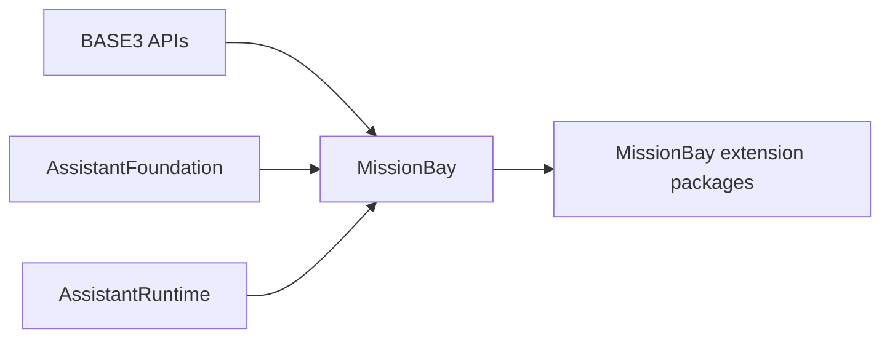
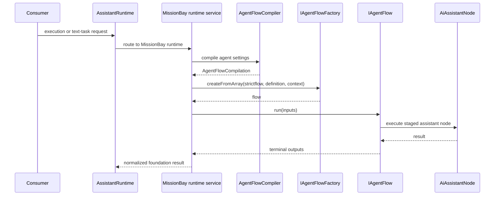

# MissionBay Architecture

## Purpose

This document describes the current architectural boundaries inside MissionBay and how it integrates with BASE3 and AssistantFoundation.

## Dependency direction

MissionBay implements contracts from AssistantFoundation and BASE3. Reusable consumers should depend on those contracts rather than MissionBay concrete classes when replacement is expected.



An extension package may intentionally depend on MissionBay when its purpose is specifically to extend MissionBay. MissionBay itself should not depend on host integrations such as MissionBayIlias.

## Container versus class map

MissionBay follows the BASE3 separation:

```text
container
  active shared service implementation

class map
  discoverable classes and getName-based selection
```

Examples of known services registered by MissionBay include:

* `IAgentContextFactory`
* `IAgentFlowFactory`
* `IAgentFlowCompiler`
* `IAgentComponentPresetRepository`
* `IAgentComponentPresetCatalog`
* `IAgentComponentPresetMaterializer`
* `IRetrievalSearchService`
* `ISpeechToTextService`
* `IRealtimeSpeechToTextSessionService`
* `ITextToSpeechService`

Examples of discoverable implementation families include:

* `IAgentFlow`
* `IAgentNode`
* `IAgentResource`
* `IAgentTool`
* `IAgentStage`
* `IAgentActionPolicy`
* AssistantFoundation service-driver definitions
* provider models and services
* displays and jobs

## Configured components

The BASE3 configured-component mechanism is used for runtime instances whose implementation class is discoverable but whose instance identity and constructor values are configured.

MissionBay uses `ComponentDefinition` for the default orchestrator stages and action policies. Component presets are a MissionBay-specific resource configuration mechanism layered on top of normal resource discovery. They do not replace the BASE3 container.

## Foundation boundary

AssistantFoundation owns contracts such as:

```text
IAgentExecutionService
IAgentConversationService
IAgentTextTaskService
IAgentStage
IAgentActionPolicy
IAgentCapabilitySelector
IAgentToolResultCache
IAiChatModel
IAiEmbeddingModel
IImageGenerationModel
IRetrievalIndex
IRetrievalCollectionDefinition
IFileParserService
ISpeechToTextService
ITextToSpeechService
```

MissionBay owns its implementation choices and MissionBay-specific composition services.

## Agent compilation boundary

`AgentFlowCompiler` translates an agent settings record into `AgentFlowCompilation`.

The compiler is intentionally separate from the generic foundation execution contract because another assistant runtime does not need to use AgentFlow at all.

The compiler:

1. requires the `chatmodel` preset
2. creates a base flow containing one `aiassistantnode`
3. loads an optional orchestrator profile
4. applies capability configuration
5. resolves tool, memory and context profile components
6. adds direct `agent_components`
7. ensures the chat model is attached exactly once
8. returns the flow definition plus warnings

## Runtime request flow



## Host extension boundary

Host-specific code belongs outside MissionBay.

MissionBayIlias is an example. It replaces `IRetrievalCollectionDefinition`, contributes ILIAS-specific resources and provides ILIAS-specific indexing jobs. MissionBay does not need to know ILIAS APIs or database tables.

## No compensating architecture

If a runtime contract is incomplete, fix the contract or the implementation boundary. Do not add parallel profiles, fallback routers, mirrored settings copies or special execution paths only to hide an inconsistent contract.

This is especially important in MissionBay because the package already has explicit boundaries for:

* runtime routing
* service-driver selection
* component presets
* orchestrator profiles
* tool profiles
* context profiles
* memory profiles
* collection mapping

New behavior should use the appropriate existing boundary or change that boundary deliberately.
